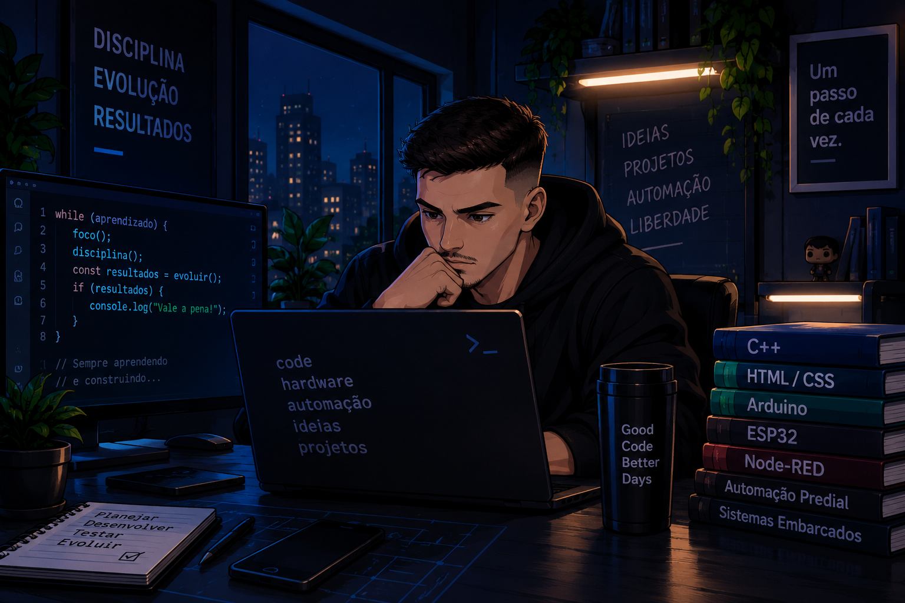

<!-- ========================================================= -->
<!--                         HEADER                            -->
<!-- ========================================================= -->

  

  

---

<!-- ========================================================= -->
<!--                       SOBRE MIM                           -->
<!-- ========================================================= -->

<table>
<tr>

<td width="65%" valign="top">

## 👋 Sobre mim

Sou **Técnico em Eletroeletrônica** e atualmente estudante de
**Desenvolvimento de Sistemas**.

Tenho interesse em projetos que envolvam **programação, eletrônica,
automação e sistemas embarcados**.

Gosto de aprender na prática, desenvolvendo projetos, testando ideias,
resolvendo problemas e buscando entender como as coisas realmente funcionam.

### 💡 Atualmente

- 🎓 Estudando Desenvolvimento de Sistemas
- ⚡ Técnico em Eletroeletrônica
- 💻 Desenvolvendo conhecimentos em programação
- 🔌 Explorando sistemas embarcados
- ⚙️ Interessado em automação
- 📡 Explorando IoT e comunicação entre dispositivos
- 🎨 Desenvolvendo interfaces e dashboards

</td>

<td width="35%" align="center">

</td>

</tr>
</table>

---

# 💻 Tecnologias

---

# 🔧 Ferramentas

---

# 🚀 Projetos em destaque

<table>
<tr>

<td width="50%" valign="top">

### 🌡️ Monitoramento IoT

Projeto de monitoramento utilizando sensores,
microcontrolador, comunicação MQTT e dashboard.

**Tecnologias**

`ESP32` `C++` `MQTT` `Node-RED`

</td>

<td width="50%" valign="top">

### 📊 Dashboards

Desenvolvimento de interfaces para visualização
e monitoramento de informações.

**Tecnologias**

`HTML` `CSS` `Node-RED`

</td>

</tr>

<tr>

<td width="50%" valign="top">

### 🔌 Sistemas Embarcados

Projetos envolvendo microcontroladores,
sensores e integração entre hardware e software.

**Tecnologias**

`C++` `Arduino` `ESP32`

</td>

<td width="50%" valign="top">

### ⚙️ Automação

Projetos envolvendo automação, monitoramento
e integração de sistemas.

**Tecnologias**

`Automação` `IoT` `BACnet`

</td>

</tr>
</table>

---

# 📊 GitHub

---

# 🐍 Contribuições

---

# 🎯 Atualmente

📚 Aprofundando meus conhecimentos em **Desenvolvimento de Sistemas**

💻 Evoluindo meus conhecimentos em **programação**

⚡ Desenvolvendo projetos que unem **software e eletrônica**

⚙️ Explorando **automação e IoT**

🚀 Transformando estudos em **projetos práticos**

---

# 📫 Contato

---

  <i>Software + Eletrônica + Automação</i>

<!-- ========================================================= -->
<!--                         FOOTER                            -->
<!-- ========================================================= -->

  

